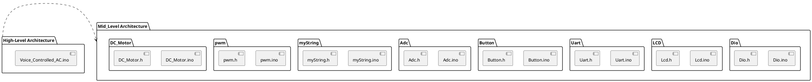
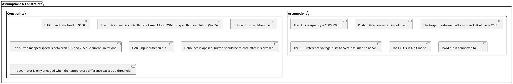
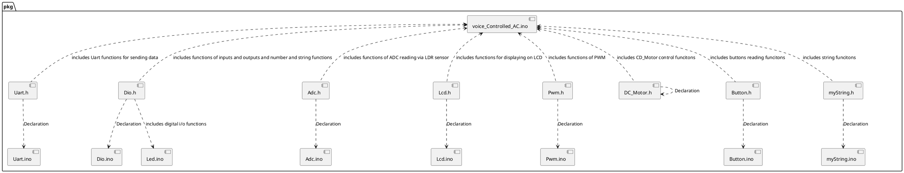

# Detailed Design Document

| **Author**              | `Nour Eldien, Tarek Mahmoud Younes, Kareem Magdy`     |
|:------------------------|:-----------------------------------------------------|
| **Status**              | `Draft`                                              |
| **Version**             | `1.0.0`                                              |
| **Date**                | `8/12/2025`                                         |

## Introduction

This document details the low-level design for the Automotive Cabin Air Management System firmware, an embedded system component built on an AVR microcontroller (arduino UNO). The system's primary function is to actively regulate the air temperature and flow within a vehicle cabin by controlling a DC Motor (used for fan or hood operation).  

The system continuously reads internal (In) and external (Out) temperatures via Analog-to-Digital Converter (ADC) channels and implements a Control Logic to automatically adjust the speed and direction (Forward/Backward/Stop) of the motor to match a target temperature.  

The human-machine interface involves:  

An LCD for continuous display of the system state, target temperature, and current In/Out temperatures.  

A Push Button for toggling the system's operational state (Start/Stop).  

A UART interface which links the embedded system to a desktop application. This interface is used to send operational state and to receive a dynamically set target temperature from the desktop application after a button press.  

### Purpose
The purpose of this detailed document is to define the implementation strategy, internal architecture, and public interfaces for the Automotive Cabin Air Management System firmware. This definition is critical for guiding the development process, ensuring:  

Accurate temperature measurement from both internal and external sensors.  

Reliable speed control of the DC motor via Pulse Width Modulation (PWM) in two directions.  

Effective Control Logic to maintain the target temperature.  

Robust UART communication to synchronize the system's state with the external desktop application, specifically enabling the dynamic setting of the target temperature upon a Stop command.  

### Scope
This document exclusively scopes the Software Design of the Automotive Cabin Air Management System firmware. It provides detailed specifications for the logic, data structures, and implementation of the following internal components:  

ADC Driver Logic: Handling the setup and reading of analog temperature sensor data from the defined In (internal) and Out (external) channels and applying the necessary calculations used for sensor calibration which is applied by multiplying the sensor reading fuction by the actual reading over the sensor reading itself.  

DC Motor and PWM Control: The logic for initializing the motor control pins, setting the DC motor's direction (Forward/Fan or Backward/Hood), and dynamically adjusting its rotational speed using Timer 1's 8-bit Fast PWM (0-255) output.  

Control Logic: The core decision-making mechanism that calculates the temperature difference to determine the required motor state, speed, and direction (an example can be seen in using the map function to scale the difference to a PWM duty cycle).  

UART Communication Protocol: The specific framing, parsing, and transmission logic for:  

    1/ Sending a message indicating the change in system state (Start/Stop) when the button is pressed.  

    2/ Receiving and parsing the new target temperature string (like  "25") from the desktop application.  

    3/ Transmitting the 15-byte status string containing the current motor state, target, internal, external temperatures, and motor speed for external monitoring.  

    4/ User Input and State Management: The handling of the debounced push button to toggle the system's operational state and trigger the appropriate UART messages and system functions.  

    5/ LCD Driver: The 4-bit mode logic for displaying current system parameters.  

## Architectural Overview

### Assumptions & Constraints

## Functional Description

### Inputs/Outputs
|Component|	Pin|	Type|	Function|
|:--------|:---|:------|:----------|
|Internal Temp Sensor(In)|	PC5| Analog Input| Reads the temperature inside the vehicle cabin (inTemp).|
|External Temp Sensor(Out)|PC0 |Analog Input| Reads the temperature outside the vehicle cabin (outTemp).|
|Control Button|PB4 |Digital Input|Toggles the system's operational state (Start/Stop) and triggers UART commands.|
|DC Motor Direction 1| PD2|	Digital Output|	Controls motor direction (in conjunction with PD3).|
|DC Motor Direction 2| PD3 |Digital Output|	Controls motor direction (in conjunction with PD2).|
|DC Motor Speed (PWM)| PB2 | PWM Output| Controls the motor's rotational speed (Duty Cycle 0-255).|
|LCD Data Pins (D4:D7)| PD4:PD7| Digital Output| Transfers 4-bit data to the LCD module.|
|LCD Enable Pin (EN)| PB1| Digital Output| Toggles the Enable signal for LCD data transfer.|
|LCD Register Select (RS)| PB0|	Digital Output|	Selects between command and data registers on the LCD.|

### Functionlity

1. Temperature Acquisition and Display 

    The system continuously reads the analog raw values from ADC Channel 5 (inTempPin) and ADC Channel 0 (outTempPin), converts them to their corresponding temperature values, and stores them in inTemp and outTemp variables.  

    The current Target Temperature, Internal Temperature, and External Temperature are continuously displayed on the LCD.  

2. System State Management and Communication  
    The system maintains an operational state (state variable, toggled between 0 and 1).  

    When the Control Button is pressed and released:  

    The system state is toggled.  

    A corresponding UART command (Start or Stop) is sent to the external desktop application to synchronize the state.  

    Upon receiving the Stop command transmission, the system then expects a UART input string from the desktop application, which contains the new Target Temperature. This string is parsed and set as the new targetTemp.  

3. Control Logic  
    The firmware implements a closed-loop control mechanism to regulate the cabin temperature:  

    The difference is calculated as the absolute value of |inTemp - targetTemp|.  

    A deadband is enforced: If difference is less than or equal to 2, the motor is stopped (stop()).  

    If difference is greater than 2, the motor speed is calculated by mapping the difference to a PWM duty cycle (mapping a difference of 0-20 to a speed of 165-255).  

    Motor Direction Logic:  

        If inTemp > targetTemp (Cabin is too hot):  

            If outTemp < inTemp (Outside air is cooler), the motor runs in Fan/Forward mode (fan(speed)).  

            Otherwise, the motor runs in Hood/Backward mode (hood(speed)).  

        If inTemp < targetTemp (Cabin is too cold):  

            If outTemp > inTemp (Outside air is warmer), the motor runs in Fan/Forward mode (fan(speed)).  

            Otherwise (outside is colder or equal), the motor is stopped (stop()).  

4. Motor Output Control  
    The determined motor direction (CW/CCW) is set via the PD2/PD3 pins(motor pins).  

    The calculated speed is written to the Timer 1 Output Compare Register (OCR1B) to control the DC motor's speed using PWM on Pin 10(PB2).  

5. Status Feedback  
    The system periodically compiles a 15-byte status string containing the motor state (F/B/S), target temperature, internal temperature, external temperature, and motor speed.  

    This status string is transmitted over UART to the desktop application for continuous monitoring and logging.  

## Implementation of the Module
After Hardware Communication:  

#### Software

###### A. Initialization Routines (Startup)  
These steps are executed once upon system power-on or reset to configure the MCU peripherals and external components for operation.  

1/UART Initialization: Configures the serial interface for communication with the external desktop application.  

    Set baud rate to 9600 bps.  

    Enable the hardware Transmitter (TX) and Receiver (RX).  

2/LCD Initialization: Sets up the output communication for the display module.  

    Set the LCD data pins (PD4:PD7) and control pins RS (PB0) and EN (PB1) as outputs.  

    Apply a 20 ms power-on delay before sending commands.  

    Send the necessary commands for 4-bit initialization.  

    Configure the display: display is ON, cursor is OFF, entry mode sets cursor to be incremented, and the screen is cleared.  

3/Button Initialization: Configures the single control button input pin.  

    Initialize the Button structure (btnSetTemp).  

    Set the associated pin (PB4) as a digital input.  

    Disable the internal pull-up resistor (as it is assumed to be connected in a pulldown configuration).  

4/ADC Initialization: Configures the Analog-to-Digital Converter for temperature reading.  

    Set the reference voltage to AVcc pin.  

    Enable the ADC and apply a prescaler of 128 to the ADC clock source to achieve an appropriate clock speed (125 kHz).  

5/PWM Initialization: Configures Timer 1 for DC Motor speed control.  

    Set the PWM output pin (PB2/OC1B) as a digital output.  

    Configure Timer 1 to run in Fast PWM Mode 14 (TOP=ICR1).  

    Set the TOP value to 255 for 8-bit resolution.  

    Set the output to Non-Inverting Mode for OC1B.  

    Start Timer 1 with No Prescaler.  

    Initialize the duty cycle to 0 (Motor Off).  

6/DC Motor Initialization: Configures the direction control pins.  

    Set the motor direction pins (PD2 and PD3) as digital outputs.  

7/Initial Display Setup: Transmits required text strings to the LCD.  

    Display the persistent labels (e.g., "Target:", "In:", "Out:") on the LCD.  

###### B. Main Loop Logic (Continuous Operation)  
This loop runs indefinitely after initialization, handling core functionality:  

1/Temperature Reading:  

    Read the raw ADC value from Channel 0 (outTempPin) and convert it to outTemp.  

    Read the raw ADC value from Channel 5 (inTempPin) and convert it to inTemp.  

2/LCD Update and Motor Control Logic:  

    Convert inTemp, outTemp, and targetTemp integers into displayable strings.  

    Conditional LCD Clear: If the length of any of the temperature values changes (e.g., from 25 to 100), the LCD is cleared and the labels are re-written to prevent trailing digits.  

    Display all current temperature values (inTemp, outTemp, targetTemp) and the motor's state (Forward, Backward, or Stopped) on the LCD.  

    Calculate Error: Determine the absolute temperature difference: difference = abs(inTemp - targetTemp).  

    Motor Control (Proportional-like Logic):  

        If difference <= 2, call stop().  

        If difference > 2, calculate speed by mapping difference to the PWM range (e.g., 165 to 255).  

        Direction Logic: Determine whether to call fan(speed) (CW), hood(speed) (CCW), or stop() based on the comparison of inTemp vs. targetTemp and inTemp vs. outTemp.  

3/Control Button Handling:  

    Monitor the state of the debounced control button.  

    If the button state changes from Released to Pressed:  

        The system's operational state is toggled (0 to 1 or 1 to 0).  

        The corresponding state command (Start or Stop) is transmitted via UART to the desktop application.  

        If the new state is 'Stop' (0): The system waits for the desktop application to send the new target temperature via UART, which is then received, parsed using simple_atoi, and saved to targetTemp.  

4/Status Feedback Transmission:  

    The system assembles the 15-byte status string containing all relevant data (motorState, temperatures, speed).  

    The status string is transmitted via UART to the desktop application.  
### Notes
1/Default Pin Configuration: Any port pin is set by default to input when its corresponding DDRx bit is clear.  

2/Motor Function Mapping: The control functions fan(speed), hood(speed), and stop() are wrapper functions that handle the setting of the DC motor direction pins and the PWM duty cycle via DC_Start and DC_Stop.  

3/Target Temperature Update: The new target temperature is specifically received from the desktop application via UART after the control button is pressed to transition the system to the Stop state.  

4/Debouncing: The button input logic requires the button to be unpressed for a duration before a subsequent press can be registered, which is handled by the underlying Button library logic.  

5/Data Type Conversion: Custom functions like simple_atoi (ASCII to Integer) and int_to_string (Integer to ASCII) are used for data handling between the control variables and the UART/LCD interfaces.

### Static Files
The UCM module consists of the following arduino and header files:

| File name     | Contents                                                                     |
|---------------|------------------------------------------------------------------------------|
| Uart.ino      | UART used-defined functions                                                  |
| Uart.h        | The header file of the UART functions that includes declarations             |
| Dio.ino       | Input and output functions                   |
| Dio.h         | The declaration file of digital input output funcitons |
| Adc.ino       | The functions of Ananlog to Digital Conversion |
| Adc.h         | The declaration ADC functions |
| Lcd.ino         | The functions of LCD |
| Lcd.h         | The declaration file of LCD functions |
| Pwm.ino       | Functions to control the motor speed via PWM pins |
| Pwm.h         | The declaration file PWM functions |
| DC_Motor.ino| Function for DC motor control|
| DC_Motor.h| The declaration file of DC motor contorl function|
| Button.ino         | Button control functions |
| Button.h         | The declaration file of button functions |
|myString.ino|  Custom string manipulation functions|
|myString.h| The declaration file of custom string funcitons
| voice_Controlled_AC.ino | Integrating all codes in one file according to the AC system function |

### Include Structure

### Configuration
The following parameters must be define according to the user case and situation.
| Name     |Value range     | Descriptio                                    |
|------------------|----------------|--------------------------------------------------|
|F_CPU             |16000000UL      |The frequency of the MCU used for baud rate calculation       |
|BaudRate          |   9600         |The fixed baud rate for serial UART communication        |
|Internal Temp ADC Channel |PC5|The Analog Channel used to read the Internal Cabin Temperature |
|External Temp ADC Channel |PC0  |The Analog Channel used to read the External Air Temperature     |
|Control Button Pin  |  PB4 |The pin for the single Start/Stop Control Button that also triggers the target temperature update |
|DC Motor Direction Pin 1 |   PB3 |One of the two pins controlling the DC Motor Direction |
|DC Motor Direction Pin 2|    PD2         |The second pin controlling the DC Motor Direction  |
| LCD RS Pin  | PB0            |   The Register Select (RS) pin for the LCD module.  |
|LCD Enable Pin   | PB1 | The Enable (EN) pin for the LCD module.   |
|LCD Data Port| PORTD (Pins 4-7)| he MCU port used for the 4-bit data transfer to the LCD| 
|Minimum Motor Speed (PWM)| 165 (out of 255)| The lowest acceptable PWM duty cycle when the motor is running to ensure effective air movement.|

